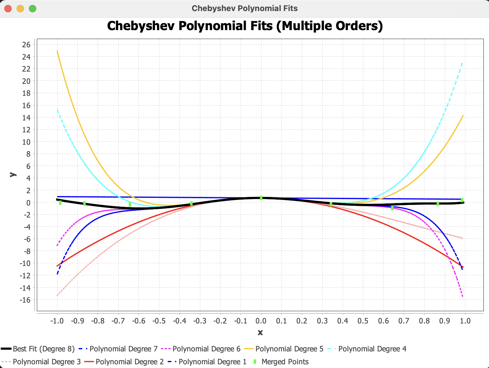

# Chebyshev Interpolation Engine (Java)

This project implements polynomial interpolation using Chebyshev nodes. The goal is to reduce oscillation near the endpoints of an interval and analyze interpolation error both numerically and visually.

The program generates Chebyshev-distributed nodes over a chosen interval, constructs the interpolating polynomial, evaluates approximation error across a dense sampling grid, and displays the results using JFreeChart.

## Why Chebyshev Nodes?

Polynomial interpolation with equally spaced nodes can produce large oscillations near the interval endpoints (Runge phenomenon).

Chebyshev nodes cluster near the boundaries of the interval, which helps reduce maximum interpolation error and improves numerical stability. This project demonstrates that behavior through printed error values and graphical output.

## What the Program Does

- Generates Chebyshev nodes on a specified interval  
- Evaluates a target function at those nodes  
- Constructs the interpolating polynomial  
- Computes maximum interpolation error across the interval  
- Plots the original function and the interpolating polynomial  
- Displays error values in the terminal  

## Example Output

### Interpolation Graph

## Compile & Run

Mac / Linux:
javac -cp ".:lib/jfreechart-1.5.6.jar" ChebyshevEngine.java
java -cp ".:lib/jfreechart-1.5.6.jar" ChebyshevEngine

Windows:
javac -cp ".;lib/jfreechart-1.5.6.jar" ChebyshevEngine.java
java -cp ".;lib/jfreechart-1.5.6.jar" ChebyshevEngine

## Notes

This project was developed as part of a numerical methods assignment focused on interpolation techniques, error analysis, and visualization of numerical behavior.
